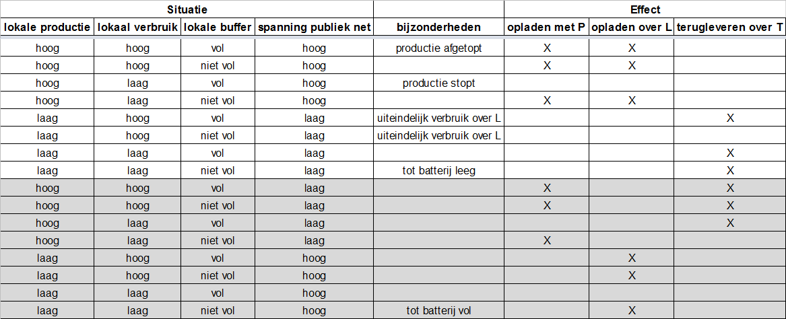

# Communicerende vaten

Conceptueel gezien vormt de elektriciteitsvoorziening van de [coöperatie](README.md) een gedistribueerd systeem van losse batterijen, elk bij een deelnemend huishouden "achter de meter", onderling verbonden via het bestaande stroomnetwerk. Huishoudelijk verbruik ter plaatse van een installatie (in onderstaande figuur afgebeeld als een lamp), wordt gevoed uit de lokale batterij, die wordt opgeladen door de lokale zonnepanelen. De P in de figuur staat voor de lokale Productie, die wordt gemeten door een kilowattuurmeter. Als het batterijniveau laag is en de productie van de zonnepanelen ontoereikend, wordt de batterij geladen met stroom uit het net, die over het Levering telwerk van de meter binnenkomt (de L in de figuur). Die stroom van "buiten" wordt in principe geleverd door één of meer andere coöperatieve installaties waar de batterij nog vol genoeg is. De stroom die daar het net in gaat, loopt over het Teruglevering telwerk van de meter (T).

Voor deelnemers met een installatie is de in het huishouden verbruikte stroom V te bepalen als de productie van de zonnepanelen, vermeerderd met de levering van buiten, verminderd met de teruglevering naar buiten: V = P + L - T. De verschillen tussen de begin- en eindniveaus van de batterlijlading laten we buiten beschouwing; uiteindelijk middelen die uit tot nul.
De energiebelasting wordt alleen geheven op het aandeel van L - achter de meter verbruikte eigen opwek is en blijft vrijgesteld, ook wanneer de salderingsregeling straks verleden tijd is.

Voor deelnemers zonder installatie is V gelijk aan L. P wordt er niet gemeten. T doet er niet mee.

## Operationalisering
Er wordt weinig actief gestuurd. Stroom heet stroom, omdat het stroomt, net als water. Van plekken met hoge spanning naar plekken met lage spanning. Als er productie is, loopt de buffer vol, tenzij het verbruik groter is dan de productie. Als er buiten de eigen aansluiting veel verbruik is, daalt de spanning op het net en gaan we terugleveren uit de buffer. Andersom, als er buiten de eigen aansluiting veel productie is, vullen we de buffer aan. Zo verdelen we onderling onze stroom - de spanning op de kabel in de straat is een schatter voor de actuele behoefte van onze collega-deelnemers.

Wellicht is het nog mogelijk om het zo aan te sluiten dat voor het opladen de lokale productie altijd voorang krijgt boven een hoge spanning op L. Maar wellicht moeten we dat niet eens willen.

Waarschijnlijk loont het wel de moeite om over die "kabel in de straat" in gesprek te gaan met de regionale Netbeheerder. Die zal sowieso blij zijn dat wij zuigen als het drukt en duwen als het zuigt. Maar het zal het beste werken als we afspraken maken over de grenswaardes van de spanning op de specifieke kabel ter plaatse. De Netbeheerder kan waarschijnlijk ook wel bepaalde lokaties aanwijzen waar een "meewerkende" installatie extra prettig zou zijn.

### Componmenten
- zonnepanelen
- omvormer
- batterij
- batterijlader
- kilowattuurmeter voor de productie (P)
- communicatiekanaal voor de standen van P
- toegang tot de meetdata (L en T) van elke aansluiting (ook die zonder installatie)

T.a.v. het communicatiekanaal: we leggen daar geen nieuwe infrastructuur voor aan, maar gebruiken de huishoudelijke internetverbinding van de installatiehuisvestende deelnemers. 
