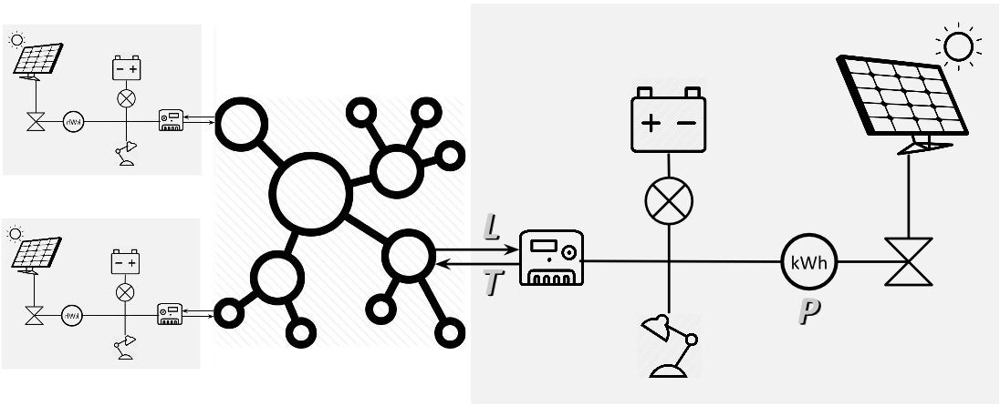

# Communicerende vaten

!!! work in progress ¡¡¡

Conceptueel gezien vormt de elektriciteitsvoorziening van de [coöperatie](README.md) een gedistribueerd systeem van losse batterijen, elk bij een deelnemend huishouden "achter de meter", onderling verbonden via het bestaande stroomnetwerk. Verbruik ter plaatse van een installatie (in onderstaande figuur afgebeeld als een lamp), wordt gevoed uit de lokale batterij. De batterij wordt opgeladen door de zonnepanelen ter plaatse. De P in de figuur staat voor de lokale Productie en die wordt gemeten door een kilowattuurmeter. Als het batterijniveau laag is en de productie van de zonnepanelen ontoereikend, wordt de batterij geladen met stroom uit het net, die op het Levering telwerk van de meter komt (de L in de figuur). Die stroom van "buiten" wordt in principe geleverd door één of meer andere coöperatieve installaties waar de batterij nog vol genoeg is. De stroom die daar het net in gaat, loopt over het Teruglevering telwerk van de meter (T).

Voor deelnemers met een installatie is de in het huishouden verbruikte stroom V te bepalen als de productie van de zonnepanelen, vermeerderd met de levering van buiten, verminderd met de teruglevering naar buiten: V = P + L - T. De verschillen tussen de begin- en eindniveaus van de batterlijlading laten we buiten beschouwing; uiteindelijk middelen die uit tot nul.
De energiebelasting wordt alleen geheven op het aandeel van L - achter de meter verbruikte eigen opwek is en blijft vrijgesteld, ook wanneer de salderingsregeling straks verleden tijd is.

Voor deelnemers zonder installatie is V gelijk aan L. P wordt er niet gemeten. T zou nul moeten zijn. Vanwege de stroombalans op het net kan het een kostenpost vormen als een "vreemde" installatie tóch gaat terugleveren. Daarom willen we T wel meten.

## Operationalisering
- Als de batterij vol is, moet de productie van de zonnepanelen stoppen.
- Zodra er stroom uit de batterij wordt verbruikt (lokaal of via T), moet de productie (weer) starten.
- Alle batterijen communiceren voortdurend hun batterijniveau en de actuele productiesterkte naar elkaar.
- Elke batterij stuurt aan op een batterijniveau dat gelijk is aan het gemiddelde niveau van alle batterijen.
- Of een batterij daarvoor moet laden via L, leveren via T, of geen van beide, hangt ervan af of z'n niveau onder of boven het gemiddelde is en of de lokale productiesterkte onder of boven het gemiddelde is.

We hebben dus nodig:
- een sensor voor de productiesterkte
- een sensor voor het batterijniveau
- een communicatiekanaal voor de sensorwaardes
- een laad- en ontlaadsturing op basis van de sensorwaardes op het communicatiekanaal

T.a.v. het communicatiekanaal: we leggen daar geen nieuwe infrastructuur voor aan, maar gebruiken de huishoudelijke internetverbinding van de installatiehuisvestende deelnemers. 

Electrotechnisch gezien bestaat een installatie uit de volgende componenten:

- zonnepanelen
- omvormer/lader?
- sturing?
- internetkoppeling?
- ?

De verbindingen tussen deze componenten zijn weergegeven in onderstaand schema:

???
